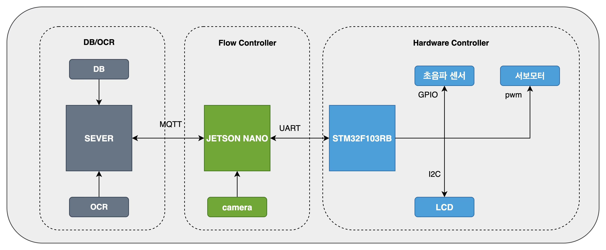
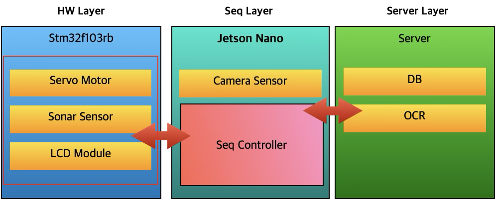
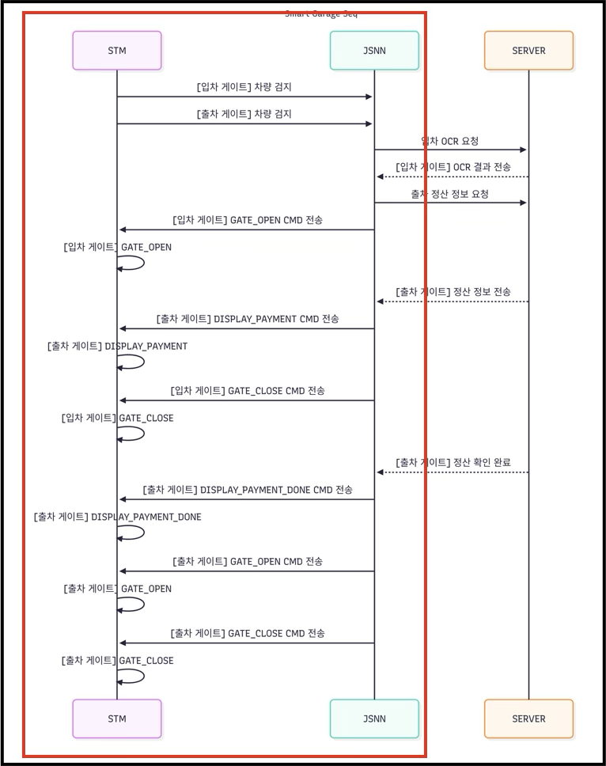
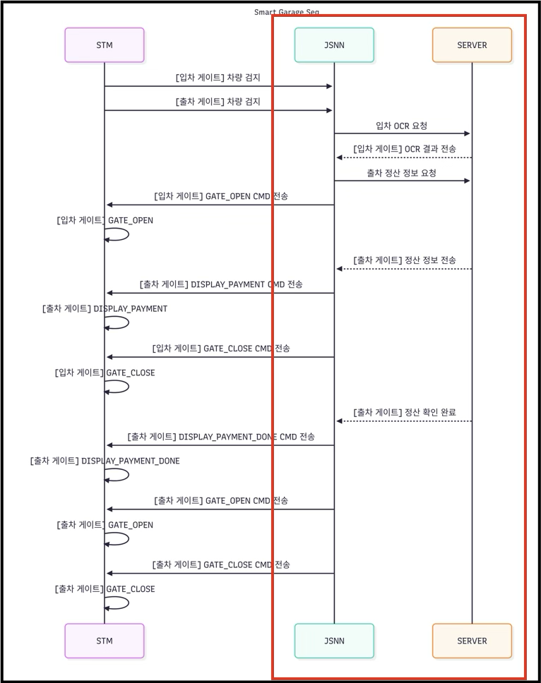

### **주차장 시스템**

### **1. 개요**

   OCR을 통해서 번호판을 인식하고, 인식한 번호판을 통해서 DB 관리, 게이트 제어를 하는 주차장을 구성하는 것

 

### **2. 시스템 구성**


| **Board**   | **Compiler**  | **Sensor**                           |      |
| ----------- | ------------- | ------------------------------------ | ---- |
| STM32F103Rb | Arm-none-eabi | Servo-Motor, Sonar sensor, LCD(1604) |      |
| Jetson Nano | Pytohn        | Camera Module                        |      |




 



#### **System Mode**

| Mode        | Explain                                                      |
| ----------- | ------------------------------------------------------------ |
| 1 Gate Mode | 게이트 한 개로 운용 되는 모드, 입차 혹은 출차 단일 모드로만 운용 가능하다. |
| 2 Gate Mode | 게이트 한 개로 운용 되는 모드, 입차 혹은 출차 단일 모드로만 운용 가능하다. |

 게이트는 Entry Gate, Exit Gate 두 종류가 존재한다. 각각 게이트는 하드웨어 초기화 하면서 지정되며, 입차/출차 할 때 사용된다. 이는 각 센서가 하나씩 밖에 없는 이유로 인해 이렇게 구성하였다.

각 게이트는 ID를 부여 받으며, 해당 ID는 이하와 같다.

**Entry Gate : 10** 

**Exit Gate : 11** 

이 ID를 인터페이스 통신에 같이 보냄으로써, Server와 Seq Layer는 어느 게이트에 명령을 할지 판단하여, 해당 게이트에 명령을 내린다.

### **3. 통신 인터페이스**

**(1) Stm32 < - > jetson Nano** 




#### **상태 명령어**

HW Layer -> Seq Layer로 보내는 상태 타입

차량 감지, 게이트 오픈 등 HW Layer를 감시하고 상태가 변화하면 이를 Seq Cont에게 보고한다.

| **타입**                   | **value(16)** | **설명**                          |
| -------------------------- | ------------- | --------------------------------- |
| **STATUS_SYSTEM_STARTUP**  | 0x19          | Stm32 시작 대기 상태              |
| **STATUS_SYSTEM_IDLE**     | 20            | 아무런 상태 X                     |
| **STATUS_VEHICLE_DETECTE** | 21            | 차량이 감지 된 상태               |
| **STATUS_GATE_OPEN**       | 22            | 게이트가 열려있는 상태            |
| **STATUS_GATE_CLOSED**     | 23            | 게이트가 닫혀있는 상태            |
| **STATUS_VEHICLE_LEFT**    | 24            | 차량이 Left 한 상태               |
| **STATUS_DISPLAY_PAYMENT** | 25            | 정산 정보 표시 상태               |
| **STATUS_DISPLAY_PAYMENT** | 26            | 정산 정보 표시 상태               |
| **STATUS_DISPLAY_PAYMENT** | 27            | 정산 정보 표시 상태               |
| **STATUS_VEHICLE_PASSED**  | 28            | Gate Open 이후 차량이 지나간 상태 |
| **STATUS_ERROR_CODE**      | FF            | Error가 발생했다는 상태           |


#### **커맨드 명령어**

Seq Layer -> HW Layer 로 보내는 명령어 타입

| **타입**                     | **Value** | **설명**                                                   |
| ---------------------------- | --------- | ---------------------------------------------------------- |
| **CMD_GATE_OPEN**            | **0x11**  | 게이트 OPEN을 위한 명령어 타입                             |
| **CMD_GATE_CLOSE**           | **0x11**  | 게이트 CLOSE를 위한 명령어 타입                            |
| **CMD_DISPLAY_PAYMENT_INFO** | **0x12**  | 출차 차량 정산 정보를 LCD 화면에 표시하기 위한 명령어 타입 |
| **CMD_DISPLAY_PAYMENT_DONE** | **0x13**  | 출차 차량 정산 완료를 LCD 화면에 표시하기 위한 명령어 타입 |
| **CMD_DISPLAY_PAYMENT_FAIL** | **0x14**  | 출차 차량 정산 실패를 LCD 화면에 표시하기 위한 명령어 타입 |
| **CMD_REQUEST_STM32_STATUS** | **0x15**  |                                                            |
| **CMD_RESET**                | **0x16**  | STM보드의 시스템을 리셋하기 위한 명령어 타입               |


**(2) jetson Nano <-> rust Server**

 


### **4. MQTT MSG 구조**  

#### **요청/상태 보고 (Jetson → 서버)**

- **TOPIC : parking/request/ocr****
  - 목적: Jetson이 차량 감지 후 서버에 OCR 처리를 요청
  - JSON 페이로드 예시:
    
    

```json
 {

  camera_id :  entrance_cam_01 ,

  timestamp  : 1755456000 : unix timestamp

  img         :  byte

}
```


- **TOPIC : parking/request/feeInfo****
  - 목적: 정산을 하기 위해 해당 번호판을 가지고 있는 데이터를 서버에 요청
  - JSON 페이로드 예시:

```json
{

  license_plate :  12가3456 ,

  timestamp : 1755456000 : unix timestamp

}
```


- **TOPIC : parking/request/StartUp****
  - JSON 페이로드 예시:

```json
{

  available_count :  10 : int ,

}
```


#### **명령/응답 (서버 → Jetson)**

- **TOPIC : parking/response/OCR****
  - 목적: 서버가 Jetson의 OCR 요청에 대한 결과를 회신할 때 사용.
  - JSON 페이로드 예시:

```json
 {

  success : true,

  license_plate :  "12가3456" ,

  accuracy : 98.5,

  request_timestamp : 1755456000 : unix timestamp

}
```


 success 필드를 통해 OCR 성공 여부를 명확히 알 수 있습니다.


- **TOPIC : parking/response/feeInfo****
  - 목적: 서버가 Jetson의 정산 차량 정보 요청에 대한 결과를 회신할 때 사용.
  - JSON 페이로드 예시:

```json
 {

  license_plate :  "12가3456" ,

  entry_time : 1755456000, : unix timestamp

  exit_time : 1755460000, : unix timestamp

  fee : 7000,

  is_paid : false,

  discount_applied :  None  

}
```


- **TOPIC : parking/response/feeResult****
  - 목적: 정산 결과 회신할 때 사용
  - JSON 페이로드 예시:

```json
 {

  license_plate :  "12가3456" ,

  fee : 7000,

  is_paid : false,

}
```


