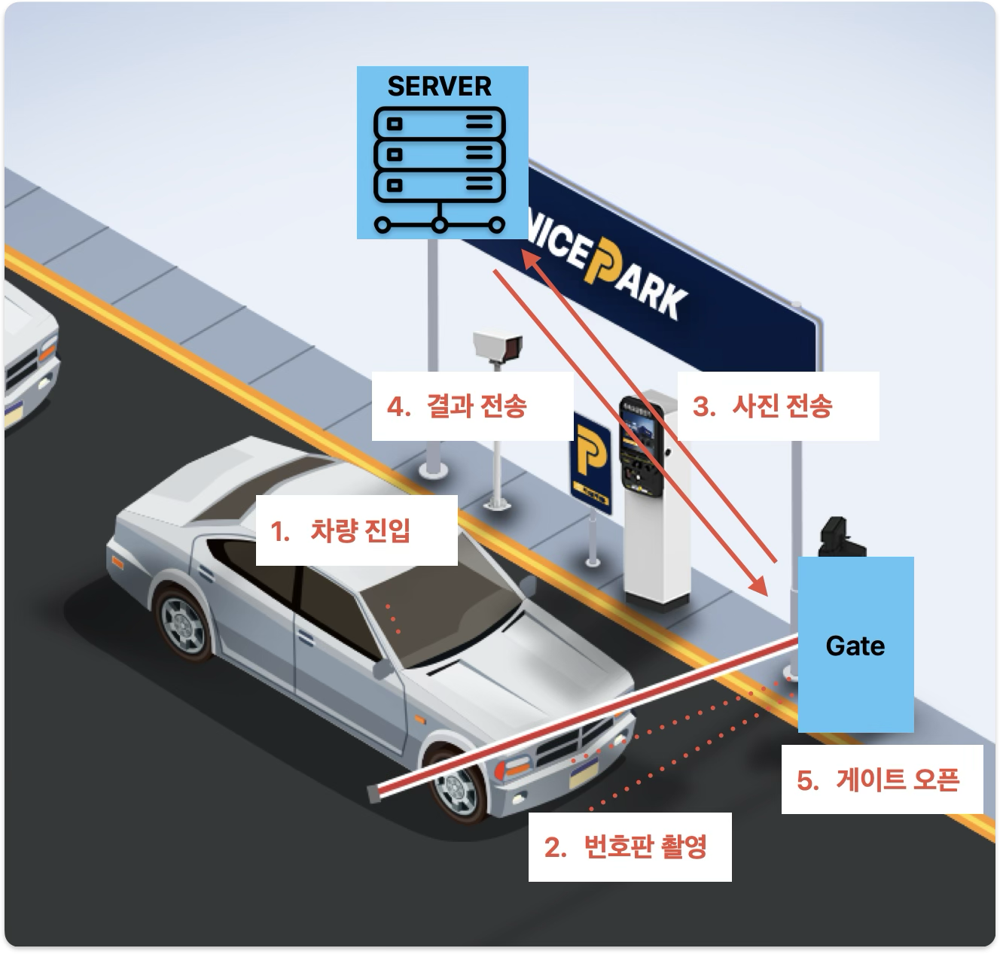

### **주차장 시스템**
**RUST SERVER**
**--> https://github.com/wangki-kyu/ocr_server <--**
### **0. 동작 환경**

|    환경      |   compiler    |
| ----------- | ------------  |
| stm32f103rb | arm-none-eabi |
| jetsonNano  | Python3.6     |

### **1. 개요**

   OCR을 통해서 번호판을 인식하고, 인식한 번호판을 통해서 DB 관리, 게이트 제어를 하는 주차장 구성

 



### **2. 시스템 구성**


 

#### **2.1. 시스템 모드**

 게이트는 Entry Gate, Exit Gate 두 종류가 존재합니다. 각각 게이트는 하드웨어 초기화 하면서 지정되며, 입차/출차 할 때 사용됩니다. 이는 각 센서가 하나씩 밖에 없는 이유로 인해 이렇게 구성하였습니다.
각 게이트의 ID는 다음과 같이 설정되어있습니다. 이 ID를 메세지에 포함시킴으로써, 각각의 레이어들은 어느 게이트인지 판단하고 입차/출차에 맞는 시퀀스 명령을 내려줍니다.
      
      Entry Gate : 10
      Exit Gate : 11

| Mode        | Explain                                                      |
| ----------- | ------------------------------------------------------------ |
| 1 Gate Mode | 게이트 한 개로 운용 되는 모드, 입차 혹은 출차 단일 모드로만 운용 가능하다. |
| 2 Gate Mode | 게이트 한 개로 운용 되는 모드, 입차 혹은 출차 단일 모드로만 운용 가능하다. |

### **3. 통신 인터페이스**

**3.1. Stm32 < - > jetson Nano** 


**3.2. jetson Nano <-> rust Server**

 


### **4. MQTT MSG 구조**  

#### **4.1. 요청/상태 보고 (Jetson → 서버)**

- **TOPIC : parking/request/ocr**
  - 목적: Jetson이 차량 감지 후 서버에 OCR 처리를 요청
  - JSON 페이로드 예시:
    
    

```json
 {

  camera_id :  entrance_cam_01 ,

  timestamp  : 1755456000 : unix timestamp

  img         :  byte

}
```


- **TOPIC : parking/request/feeInfo**
  - 목적: 정산을 하기 위해 해당 번호판을 가지고 있는 데이터를 서버에 요청
  - JSON 페이로드 예시:

```json
{

  license_plate :  12가3456 ,

  timestamp : 1755456000 : unix timestamp

}
```


- **TOPIC : parking/request/StartUp**
  - JSON 페이로드 예시:

```json
{

  available_count :  10 : int ,

}
```


#### **4.2. 명령/응답 (서버 → Jetson)**

- **TOPIC : parking/response/OCR**
  - 목적: 서버가 Jetson의 OCR 요청에 대한 결과를 회신할 때 사용.
  - JSON 페이로드 예시:

```json
 {

  success : true,

  license_plate :  "12가3456" ,

  accuracy : 98.5,

  request_timestamp : 1755456000 : unix timestamp

}
```


- **TOPIC : parking/response/feeInfo**
  - 목적: 서버가 Jetson의 정산 차량 정보 요청에 대한 결과를 회신할 때 사용.
  - JSON 페이로드 예시:

```json
 {

  license_plate :  "12가3456" ,

  entry_time : 1755456000, : unix timestamp

  exit_time : 1755460000, : unix timestamp

  fee : 7000,

  is_paid : false,

  discount_applied :  None  

}
```


- **TOPIC : parking/response/feeResult**
  - 목적: 정산 결과 회신할 때 사용
  - JSON 페이로드 예시:

```json
 {

  license_plate :  "12가3456" ,

  fee : 7000,

  is_paid : false,

}
```

### **5. 결론**
 카피 아이디어로 실제 구현까지 만들어봤는데 HAL을 많이 써보지 않다보니까 익숙지 않았다. 그리고 다음번엔 1602LCD 와같은 기초적인 것이 아니라 
 TFT LCD등 제어해, 좀더 가시성이 좋은 UI를 만들 수 있도록 해야겠다. 그리고 센서의 양이 충분치 않아서 게이트를 하나로 만들고 입차/출차 게이트 하나로 만들었는데 카메라가 두개가 아니다 보니까
 어쩡쩡한 결과물이 나왔던 것 같다. 아쉽지만 다음에는 좀 더 완벽한 결과물을 만들 수 있도록 해야겠다

